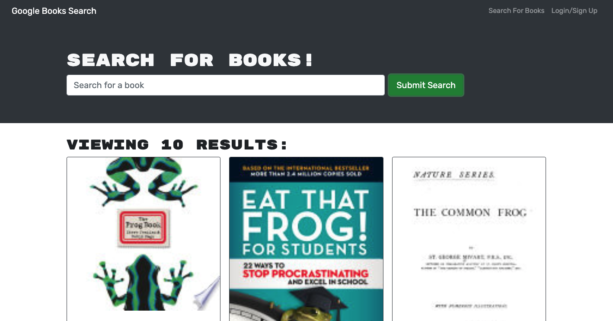

# Book-Search

 
 [View Live App Here](https://enigmatic-headland-86880.herokuapp.com/)
 
 [Github](https://github.com/cgsdesign/Book-Search)

## Description 

For this project I worked with MERN and Heroku to make a google book search app where a user can save there favorited book hosted on Heroku.

## Key Features
* Ability to search google books
* Ability to create user accounts and login
* Ability to save books
* Ability to view and delete saved books

## Installation
Download files from [this github repo](https://github.com/cgsdesign/Book-Search). Install dependencies. 
* Note: this app is intended for Google Crome Use Only.

## License
* MIT

## <a name="badge">Badges</a>

## <a name="contributing">Contributing Information</a>
* [Contributor Covenant](https://www.contributor-covenant.org/)

## <a name="questions">Questions</a>
### contact me at: 
* github: [https://github.com/cgsdesign](https://github.com/cgsdesign)
* email: [cgsdesignmadison@gmail.com](cgsdesignmadison@gmail.com)
